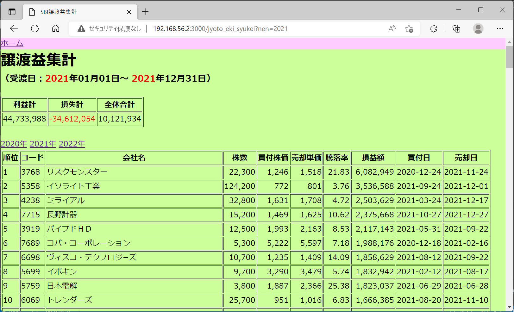

# [概要]

  このプログラムは、SBI証券における  
  (※)　「譲渡益明細ＣＳＶファイル」  
  を Linux VM上にあるMySQL DBで集計し、WEB画面にて銘柄ごとの損益一覧をランキング形式で表示するものである。  
　　(VirtualBox等 Linux VM上からの個人的な使用を想定し、画面デザインは簡素化している）  

　　(※取得方法) SBIログイン ＞ 口座管理 ＞ 取引履歴 ＞ 譲渡益明細 ＞ ＣＳＶダウンロード

# [バージョン]  
  - Ruby 3.1.1  
  - Rails 7.0  
  - MySQL Server 8.0  

  (前提)
   上記、構成にて Linux 上にインストール済みであること

# [データベース構成]  
  - (DB名) development
  - (TABLE名) jyoto_eki_meisai2020s
  - (TABLE名) jyoto_eki_meisai2021s
  - (TABLE名) jyoto_eki_meisai2022s

# [画面仕様]  
  - アクセスURL ( http://192.168.56.2:3000/home/index )
  - トップメニュー画面
  - 譲渡益明細アップロード画面  
    - CSVアップロード画面（2020年/2021年/2022年のCSVに対応）
    - アップロード時に前処理として [2020/2021/2022 該当年] のテーブルレコードが全て削除される  
    
    ※ ToDo ⇒ 現状では、2023年以降は機能追加が必要

  - 譲渡益明細集計画面
    - 銘柄ごとの損益一覧（損益が大きい順に表示）

# [プログラム仕様]    
　　*rails_project 配下の各ディレクトリ構成* 
   - 【app/controllers】
     - csv_upload_controller.rb　　　　⇒　CSVアップロード画面コントローラ
     - home_controller.rb　　　　　　　⇒　TOPメニュー画面コントローラ
     - joto_eki_syukei_controller.rb　⇒　譲渡益修正画面コントローラ

   - 【app/models】
     - jyoto_eki_meisai2020.rb
     - jyoto_eki_meisai2021.rb
     - jyoto_eki_meisai2022.rb    
      2020年～2022年のＣＳＶデータ格納テーブル (2023年以降は追加要)  
     - jyoto_eki_syukei.rb  
      　集計用ＳＱＬの実行モデル

   - 【app/views】
     - csv_upload/index_jyo_to_eki.html.erb　⇒　CSVアップロード画面ビュー
     - home/index.html.erb　　　　　　　　　　⇒　TOPメニュー画面ビュー
     - jyoto_eki_syukei/index.html.erb　　　　⇒　譲渡益集計画面ビュー

   - 【lib】
     - csv_import.rb　⇒　CSVアップロード処理(DB更新ロジック)

# ■ データベース 初期設定 手順
   1. 下記 LinuxコマンドにてMySQLコンソールを起動する  
      mysql -u root -proot development 

   2. 下記、SQLを実行し jyoto_eki_meisai2020s テーブルを作成する

　　`CREATE TABLE `jyoto_eki_meisai2020s` (  
  `id` bigint NOT NULL AUTO_INCREMENT,  
  `code` int DEFAULT NULL,  
  `name` varchar(255) DEFAULT NULL,  
  `torikesi` varchar(255) DEFAULT NULL,  
  `yakujo_bi` date DEFAULT NULL,  
  `count` int DEFAULT NULL,  
  `torihiki` varchar(255) DEFAULT NULL,  
  `ukewatasi` date DEFAULT NULL,  
  `baikyaku` int DEFAULT NULL,  
  `hiyo` int DEFAULT NULL,  
  `syutoku_bi` date DEFAULT NULL,  
  `sinki_gaku` int DEFAULT NULL,  
  `son_eki_gaku` int DEFAULT NULL,  
  `chiho` int DEFAULT NULL,  
  `created_at` datetime(6) NOT NULL,  
  `updated_at` datetime(6) NOT NULL,  
  PRIMARY KEY (`id`)  
);`  

  3. jyoto_eki_meisai2021s , jyoto_eki_meisai2022s テーブルも上記 同様に作成する  
  (上記 CREATE TABLE文の TABLE NAME部分を修正し実行する)  

# ■ ＣＳＶ集計の画面操作 手順  

  ＜事前準備＞  
    1. SBI証券よりログインし、「譲渡益明細ＣＳＶファイル」をダウンロードする  

　　2. CSVファイルをExcelで開き編集する  

      2.1 ヘッダ行の上部にある コメント行（1～20行目）は集計対象外となるため行を削除する  
      2.2 ヘッダ行（日本語）を下記の通り英語（DBカラム名に相当）に差し替えてＣＳＶファイルを保存  

    【差し替え前のヘッダ】
 `銘柄コード 銘柄 譲渡益取消区分 約定日 数量 取引 受渡日 売却/決済金額 費用 取得/新規年月日 取得/新規金額 損益金額/徴収額 地方税`  

    【差し替え後のヘッダ】
  `code name torikesi yakujo_bi count torihiki ukewatasi baikyaku hiyo syutoku_bi sinki_gaku son_eki_gaku chiho`  

      2.3 エディタ（Terapad等）でＣＳＶファイルを開き、文字コードを 【 UTF-8N 】 形式で保存する  

  ＜画面操作＞
  1. （・・/rails_projec） ディレクトリで、下記 Linuxコマンドで railsサーバ を起動する  

  `rails s -b 0.0.0.0`  

  2. ブラウザにてローカルWEBサーバへアクセスする  
  `http://192.168.56.2:3000/home/index`  

      2.1. 譲渡益明細アップロード リンクを選択し、csvファイル（上記2.3で保存したもの）をアップロードする  
      - プルダウンメニューより、対象年を選択する  
      - CSVファイルを選択し、アップロードボタンを押下  

      2.2. ホームリンク を選択 ⇒ 譲渡益集計リンクを選択し、集計画面を参照する  
　　　(画面上部リンクから 2020/2021/2022年 を切り替え可)  

   
  ＜サンプル画面＞  
  

{:target="_blank"}
  

   

以上
